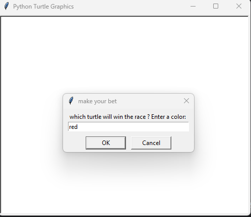
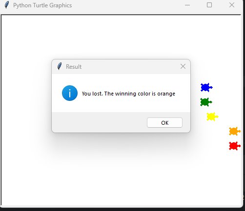

# Turtle Race Game 🐢🏁

)

Welcome to the Turtle Race Game! This is a fun and interactive game where you get to bet on which turtle will win the race. Are you feeling lucky? Let's get started!

## How to Play 🎮

1. Clone or download this repository to your local machine.
2. Make sure you have Python and the `turtle` library installed.
3. Open the terminal (command prompt) and navigate to the directory where the `turtle_race.py` file is located.
4. Run the following command to start the game:
    python turtle_race.py
5. A window will pop up, and you'll be asked to make your bet. Enter the color of the turtle you think will win the race.
6. The turtles will start racing! Sit back and watch the excitement.
7. Once the race is over, a message box will appear to inform you whether you won or lost the bet.

## Rules 📜

- There are six turtles of different colors racing against each other.
- The race will continue until one of the turtles reaches the finish line, which is at x-coordinate 220.
- The distance each turtle moves in one step is randomly chosen between 0 and 10 pixels.
- If your chosen turtle wins the race, you win the bet! Otherwise, you lose the bet.

## Screenshots 📷

## Contributions 🤝

Contributions to this project are welcome! If you have any ideas for improvements or new features, feel free to create a pull request. Let's make this game even more enjoyable together.

## About 🐢

The Turtle Race Game is a simple yet entertaining Python program that showcases the capabilities of the `turtle` library. It's a great way to have fun and explore Python's graphical abilities in a playful manner. Enjoy the race and may the odds be in your favor! 🍀
